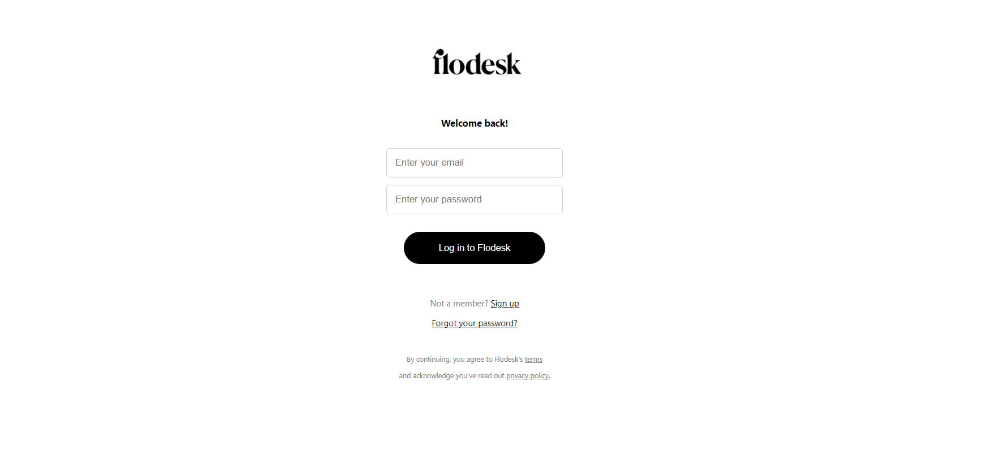

# CodeCaro-CSS
In this repository i am adding CodeCaro tasks on Css
 

Output of every Assignment is provided on each file named as Output.png
 

I also attached output's of Every Assignment in the Markdown
 

## Day1
### Assignment1: 

### Assignment2: 

### Assignment3: 

### Assignment4: 

